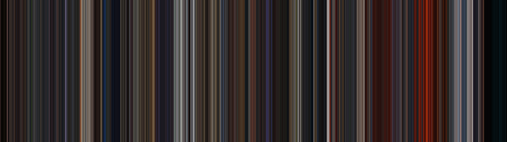

# Movie Palette Generator
Generate movie palettes from this script.

## Example

Palette for Star Wars: Revenge of the Sith

## Usage and setup:
* Create a virtual environment using `python3 -m venv .venv` and activate it.
* Install the requirements using `pip install -r requirements.txt`.
* Run `python main.py input.mp4 output.png`.
* To view other options, use `python main.py --help`.

## Suggestions for video file:
* Resize to 720p
* Set it to 1 frame per second i.e. choose one frame for each second. While this may lead to some loss in information, I don't believe its signifcant. Plus you can set it to whatever you want and see the output for yourself.

FFMPEG command to implement above suggestions:
```bash
ffmpeg -i input.mp4 -vf "fps=1,scale=iw/4:ih/4" output.mp4
```

I used the scale command to scale down the res to a quarter of the original.